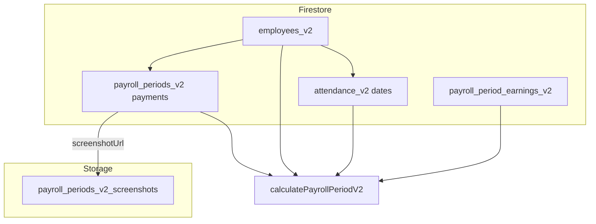

# Payroll overhaul — single source of truth

**This file is the merged plan** for the Matchanese payroll / attendance v2 work. Older Cursor plan files (if any) and **[PAYROLL_RESTRUCTURE_ANALYSIS.md](PAYROLL_RESTRUCTURE_ANALYSIS.md)** are supporting material: use this doc for **status**, **order of work**, and **your action checklist**. Deep performance notes and Q&A live in the analysis doc.

**Canonical doc location:** [admin-payroll/PAYROLL_MAJOR_OVERHAUL_PLAN.md](PAYROLL_MAJOR_OVERHAUL_PLAN.md)  
**Stale copy:** `admin-payroll_legacy/PAYROLL_MAJOR_OVERHAUL_PLAN.md` — do not treat as current.

---

## 0. Where you are (read this first)

Work proceeds top-to-bottom. **Done** means implemented in this repo unless noted as an ops step you still must run in Firebase Console / CLI.

1. **Infrastructure (rules, indexes, Storage rules, Cloud Function)** — **Done** in repo; **you** still deploy when files change (§5 Phase A).
2. **Data model + shared code** — **Done:** `employees_v2` / `attendance_v2` shape, `PayCalculator`, [shared/js/payrollPeriods.js](../shared/js/payrollPeriods.js).
3. **Migration tool** — **Done:** A/B/C panels, `migration_v2_status/v2_global_status`, per-period attendance status ([migration-tool/](migration-tool/index.html)).
4. **Admin: bulk load & period UX** — **Done:** uncapped period list, `loadDataRunId`, roster dates omit selfie URLs in the UI model, scoped SM North sales, hybrid **`calculatePayrollPeriodV2`** totals ([admin-payroll/js/admin-script.js](js/admin-script.js)).
5. **Admin: punch photos after text paint** — **Done:** (a) main roster build omits selfie URLs on list rows; (b) **thumbnails** in expand/detail, single-employee table, and mobile use **`data-src` + `scheduleDeferredThumbLoads`** (real `src` assigned on idle / next frame after layout) so times and totals show first, then images load — click thumb still opens the modal (ship with `APP_VERSION` / `?v=` bumped).
6. **Backlog (product + security)** — **Not started:** earnings CRUD, employee portal paid status from `payroll_periods_v2`, callable auth hardening — see §6 rows 5–7.

**Why changing the payroll period can still feel slow:** that action re-runs **`loadData`** (many Firestore reads), the callable, payments, **`filterData`**, and a full table render. Deferred thumbs only change **when** the browser starts fetching punch images (after first paint), not how much **Firestore** work runs per period.

---

**You are here:** If Phase A is deployed and you have run the migration tool through a pilot (or full) period, you are **past §5 Phases A–B** for that environment. Use **§5 Phase C** to verify, then **Phase D** for cutover. **Next product tasks** are §6 items **5–7** (earnings CRUD, portal alignment, callable hardening), not the items already marked shipped in §3–§4.

---

## 1. Locked decisions (summary)

| Topic | Decision |
|-------|----------|
| **Parallel data** | Legacy collections unchanged: `employees`, `attendance`, `payment_confirmations`. New work uses **`_v2`** collection names in the **same** Firebase project. |
| **Canonical apps** | Folders **without** `_legacy`: `admin-payroll/`, `employee-attendance/`, `payroll/` — talk to **`employees_v2`**, **`attendance_v2`**, etc. |
| **Legacy apps** | Folders `*_legacy/` — talk to legacy collections only. |
| **Rates** | **`rateHistory`** array on `employees_v2` for per-**periodId** rates; **`baseRate`** = current default / UX. |
| **Paid status (v2)** | **`payroll_periods_v2/{periodId}/payments/{employeeId}`** — not top-level `payment_confirmations_v2`. |
| **Screenshots** | Image **files** in **Firebase Storage** under `payroll_periods_v2_screenshots/`; **`screenshotUrl`** on the payment doc (same pattern as legacy `payment_confirmations/` in Storage). |
| **Monthly pay** | Fixed gross per pay period (twice-monthly); see §8. |

---

## 2. Glossary: who reads what

| Term | Meaning |
|------|--------|
| **Canonical** | The supported app + Firestore paths for new work (this repo’s non-`_legacy` folders + `_v2` data). |
| **Legacy** | Frozen behavior: `*_legacy` apps + non-`_v2` collections for rollback and old URLs. |
| **`_v2` in names** | **Data namespace** in Firestore/Storage — not a third “app version” folder. |

### 2.1 Apps ↔ Firestore (current)

| App folder | Firestore (primary) | Notes |
|------------|---------------------|--------|
| [admin-payroll/](.) | `employees_v2`, `attendance_v2`, `payroll_periods_v2/.../payments`, reads `payroll_period_earnings_v2` via CF | Payment UI writes period nested payments; Storage uploads to `payroll_periods_v2_screenshots/`. |
| [employee-attendance/](../employee-attendance/) | `employees_v2`, `attendance_v2` | Still reads **`payment_confirmations`** for employee-paid view (legacy collection) — align in backlog if staff should see v2-only data. |
| [payroll/](../payroll/) | `employees_v2`, `attendance_v2` | Employee dashboard. Imports Firebase config from [employee-attendance/js/firebase-setup.js](../employee-attendance/js/firebase-setup.js). |

**Legacy HTML apps (Firestore `employees` + `attendance`, not `_v2`):** [attendance_legacy/](../attendance_legacy/), [staff-attendance_legacy/](../staff-attendance_legacy/), [attendance-old_legacy/](../attendance-old_legacy/) — use only for rollback or special cases; canonical time-in is [employee-attendance/](../employee-attendance/).

### 2.2 Data model at a glance

| Collection / path | Purpose |
|-------------------|--------|
| **`employees_v2/{id}`** | Name, `baseRate`, `rateHistory[]`, `payType`, `monthlySalary`, etc. |
| **`attendance_v2/{id}/dates/{date}`** | Daily punches (same shape as legacy attendance dates). |
| **`payroll_periods_v2/{periodId}/payments/{employeeId}`** | Paid / partial paid, amounts, method, **`screenshotUrl`**. |
| **`payroll_period_earnings_v2/{docId}`** | Extra period lines (bonuses, adjustments) with `periodId`, `employeeId`, `amount` — **not** the same as “marked paid”; summed in Cloud Function. |
| **Legacy** `payment_confirmations/{employeeId}_{periodId}` | Legacy admin + some flows; migrate into `payroll_periods_v2` when cutting over. |

**Why two “payroll_period*” names:** `payroll_period_earnings_v2` = **line items**; `payroll_periods_v2` = **period bucket + payments subcollection**. Different jobs; names are long to avoid clashing with legacy.

### 2.3 Period IDs (must match admin)

- **`periodId`** string is always **`YYYY-MM-DD_YYYY-MM-DD`** (pay period start_end in local dates).
- **Single implementation:** [shared/js/payrollPeriods.js](../shared/js/payrollPeriods.js) exports **`formatDate`**, **`generatePayrollPeriods`**, **`getPeriodDatesFromId`**. Canonical admin imports it from [admin-payroll/js/admin-script.js](js/admin-script.js); the migration tool imports the same file so rows match the payroll dropdown and legacy payment doc ids (`employeeId_${periodId}`).

### 2.4 Migration tool (table + status)

| Piece | Behavior |
|-------|----------|
| **Panels** | **A)** one-time **employees** · **B)** one-time **payments** · **C)** **attendance** per period · optional flat v2 import. |
| **Period list / cache** | Full history from Firestore scan (or browser cache of earliest date); **`migrate payments (once)`** status on **`migration_v2_status/v2_global_status`** (not `__…__` ids — reserved in Firestore). |
| **Per-period table** | **`migration_v2_status/{periodId}`** holds **`attendanceStatus`** (+ optional **`lastError`** for attendance). |
| **Row actions** | **Attendance** button (or **migrate all periods** for C) copies legacy date docs in range → **`attendance_v2`**. |
| **Global** | **Refresh status**; **Import payment_confirmations_v2** (optional). |

Re-running a section is **idempotent** for data (`setDoc` merge) aside from status flags.

---

## 3. What is already done (verified in repo)

| Area | Done | Evidence / notes |
|------|------|-------------------|
| Firestore rules file | Yes | [firestore.rules](../firestore.rules) — open dev rules; **redeploy when changed**. |
| Storage rules for v2 screenshots | Yes | [storage.rules](../storage.rules) — `payroll_periods_v2_screenshots` match. |
| Indexes | Yes | [firestore.indexes.json](../firestore.indexes.json) — **deploy if indexes change**. |
| Cloud Function `calculatePayrollPeriodV2` | Yes | [functions/index.js](../functions/index.js), [functions/README.md](../functions/README.md) |
| Node `PayCalculator` + `rateHistory` merge | Yes | [functions/payCalculator.js](../functions/payCalculator.js), [shared/js/PayCalculator.js](../shared/js/PayCalculator.js) |
| Shared payroll period calendar | Yes | [shared/js/payrollPeriods.js](../shared/js/payrollPeriods.js) (used by admin + migration tool) |
| Admin: `_v2` paths, period payments, `rateHistory` UX; scoped sales load; main roster omits selfie URLs in rows; **deferred punch thumbs** in expand/detail, single-employee table, mobile (`data-src` → `src` after paint; thumb opens modal); **`calculatePayrollPeriodV2` for totals** (fallback client calc if call fails) | Yes | [admin-payroll/js/admin-script.js](js/admin-script.js) |
| Migration tool (period **table**, `migration_v2_status`, sections, legacy scan) | Yes | [migration-tool/](migration-tool/index.html) |
| Employee-attendance + payroll: `employees_v2` / `attendance_v2` | Yes | `employee-attendance/js/script.js`, `payroll/js/script.js` |

---

## 4. What is not done (and why it matters)

| Item | Why it exists | Impact if skipped |
|------|----------------|-------------------|
| ~~**Admin UI calls `calculatePayrollPeriodV2`**~~ | ~~Server-side parity~~ | **Done (hybrid):** callable fills **`totalPayWithBonus`** per employee when reachable; client calc if call fails. |
| ~~**Lazy / split photo loading**~~ | ~~Payload + browser image fan-out~~ | **Done (two layers):** (a) bulk **`loadData`** keeps **`timeInPhoto` / `timeOutPhoto`** off the main roster model so list rows do not embed thumbs. (b) **Detail paths** render **thumbnails** with **`data-src`** and set **`src`** on **`requestIdleCallback`** (or rAF) so text paints first; images then load in the background (Firestore still returns URLs in full date reads; optional later: field masks / slimmer docs). |
| ~~**Scoped SM North sales load**~~ | ~~Fewer reads~~ | **Done:** **`loadSalesData('sm-north', start, end)`** by document id range. Optional later: modal-only photo fetch. |
| **`payroll_period_earnings_v2` admin CRUD** | Adjustments without code deploy | Manual Firestore edits or missing lines in totals. |
| **Employee portal reads v2 payments** | Today may still use `payment_confirmations` | Staff may not see paid status that only exists under `payroll_periods_v2`. |
| **Callable auth hardening** | Production security | Open callables are risky. |
| **Mid-loop resume** (e.g. employee 400 of 500) | Huge one-shot runs | Migration status is **global** (employees/payments) + **per period** (attendance); re-runs are merge-safe. Fine-grained resume not implemented. |
| **Naming / glossary polish** | Readability | Optional; renaming Firestore collections is a **migration**, not a rename in place. |

---

## 5. Your execution order (what you should do)

Do these **in order** after pulling latest code. Adjust if Console already matches.

### Phase A — Deploy (Firebase)

1. **`firebase login`** / correct project: **`firebase use`** → `matchanese-attendance` (or your project in [.firebaserc](../.firebaserc)).
2. **Firestore rules:** `firebase deploy --only firestore:rules`  
   - **Why:** Rules in repo must match production for `_v2` paths.
3. **Firestore indexes:** `firebase deploy --only firestore:indexes`  
   - **Why:** Queries on `attendance_v2` date ranges and earnings need indexes; deploy after changes.
4. **Storage rules:** `firebase deploy --only storage`  
   - **Why:** `payroll_periods_v2_screenshots` must be allowed or uploads fail.
5. **Functions:** `cd functions && npm install` then from repo root `firebase deploy --only functions`  
   - **Why:** `calculatePayrollPeriodV2` and calculator updates must match client.

### Phase B — Data migration (when ready)

1. Open **[migration-tool/index.html](migration-tool/index.html)** (`.../admin-payroll/migration-tool/`).
2. **Load all periods** (scans Firestore / uses saved browser cache for earliest date).
3. Run **A) Migrate employees (once)** and **B) Migrate payments (once)**; status on **`migration_v2_status/v2_global_status`**.
4. Run **C)** per period: use **Attendance** on each row and/or **Migrate attendance — all periods**, or test one period first.
5. **Refresh status** as needed. Optional: **Import payment_confirmations_v2** once if you used the old flat collection.
6. **Verify** in canonical admin: roster, attendance, paid indicators for a pilot period.

### Phase C — Verify

- [ ] Network tab / Firestore: new reads hit `employees_v2`, `attendance_v2`, not legacy-only.
- [ ] Confirm payment screenshot upload works (Storage path + rules).
- [ ] Spot-check totals vs legacy calculator for a few employees (migration pilot).
- [ ] Optional: call `calculatePayrollPeriodV2` from a small test page or console (see [functions/README.md](../functions/README.md)).

### Phase D — Cutover (business decision)

- Point staff to **canonical** URLs (`/admin-payroll/`, not `_legacy`) when you are ready.
- Stop dual-writing legacy attendance only when you accept legacy apps as read-only or retired.

---

## 6. Comprehensive backlog (ordered)

**Goal:** Ship in this order unless a blocker forces otherwise.

| # | Task | Type | Why |
|---|------|------|-----|
| 1 | Keep **rules / indexes / storage / functions** deployed whenever repo changes | Ops | Avoids silent client failures. |
| 2 | Run **migration tool** for pilot period, then expand | Data | Populates `_v2` for real testing. |
| 3 | ~~**Wire admin** to **`calculatePayrollPeriodV2`**~~ | ~~Feature~~ | **Shipped (hybrid):** totals after each load when callable succeeds. |
| 4 | ~~**Scope sales load** + **deferred punch thumbnails** (roster + detail/mobile UI)~~ | ~~Performance~~ | **Shipped:** ranged sales; roster without embedded thumbs; detail/mobile hydrate thumb `src` after first paint. |
| 5 | **Earnings CRUD** for `payroll_period_earnings_v2` | Feature | Avoid manual Firestore edits. |
| 6 | **Employee app**: read paid status from `payroll_periods_v2` if staff should see v2 payments | Consistency | Aligns with admin payment location. |
| 7 | **Auth / validation** on callable | Security | Before wide exposure. |
| 8 | Optional: **rename collections** only after a written migration plan | Cleanup | See naming discussion; not required for correctness. |

---

## 7. Migration: before or after “everything”?

- **Pilot:** Migrate **employees + one period** of attendance (+ payments) as soon as Phase A is deployed — **valid** for testing; tooling supports it.
- **Full cutover:** Prefer completing **Phase A**, **pilot migration**, and **spot-checks** before telling everyone to use canonical apps only.

---

## 8. ADR: Monthly pay (fixed, twice-monthly)

- **`payType === "monthly"`** → fixed gross per pay period; **`periodGross`** or **`monthlySalary / 2`** per schedule.
- Prefer **`periodGross`** on the **`rateHistory`** entry for that period when overriding.

---

## 9. Risks

| Risk | Mitigation |
|------|------------|
| Dual writers to legacy + v2 attendance | Time-box cutover; canonical time-in should be the only writer to `attendance_v2` when live. |
| Stale cached JS / service worker | Bump `?v=` on scripts / `APP_VERSION` in [admin-payroll/index.html](index.html) when shipping behavior changes. |
| Old `payment_confirmations_v2` docs | Migration tool step (4) or leave orphaned; admin no longer writes there. |

---

## 10. Related documents (not duplicated here)

- **[PAYROLL_RESTRUCTURE_ANALYSIS.md](PAYROLL_RESTRUCTURE_ANALYSIS.md)** — Older deep-dive (bottlenecks, Q&A). Prefer this doc for **current ops + status**; use the analysis file only when you need historical discussion.
- **[functions/README.md](../functions/README.md)** — Callable API for `calculatePayrollPeriodV2`, including security notes.

---

## 11. Performance addendum (summary-first admin roster)

**Goal:** The main payroll summary (same columns as the dashboard table) should load from **one** `calculatePayrollPeriodV2` round-trip when possible: no per-employee Firestore `getDocs` on `attendance_v2/.../dates` for the initial table. Per-day rows and punch photos load when you **expand** an employee or open detail (lazy load).

**Current admin behavior:** Main payroll table loads **per-employee** `attendance_v2/.../dates` for the selected period on the client (roster rows omit punch photo URLs; full rows load on expand/detail). Period totals use **client** `PayCalculator` + `calcTotalPaySimple`; SM North sales bonus is recalculated and **merged to Firestore** when it differs from stored values. **`calculatePayrollPeriodV2`** is not used by the admin roster path (Cloud Function remains available for tooling or future use). **Period earnings** UI and **employee app** v2 payments (see above) are unchanged.

---

*Document version: **2.6** — Section 11 aligned with client-side roster load; admin script 2.0.12.*
